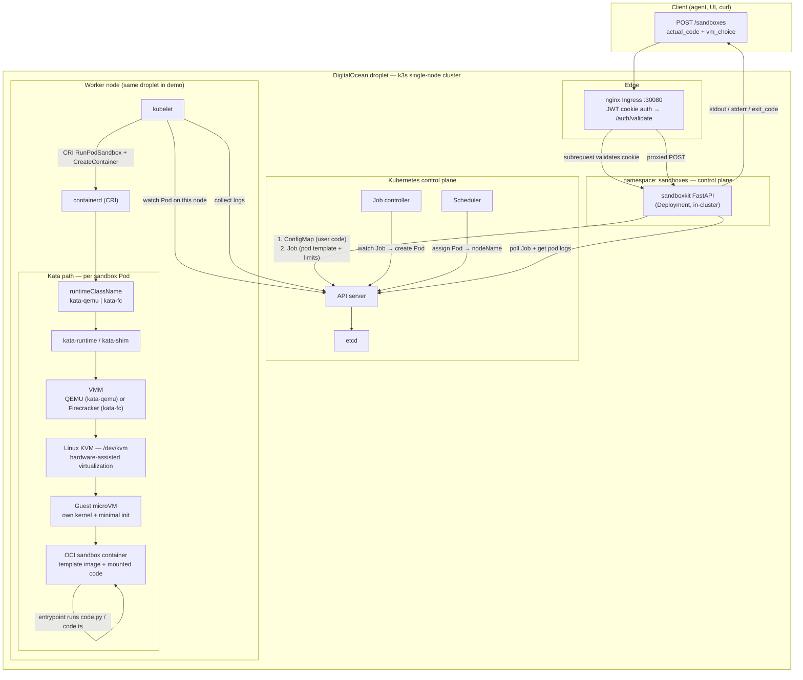

# SandboxKit

A minimal **sandbox-as-a-service** for running untrusted agent code in isolation — a take-home slice of what providers like E2B, Modal, and Cloudflare Sandboxes do at scale.

---

## Context

Coding agents need somewhere safe to run untrusted code. Today many teams use hosted sandbox providers; for on-prem deployments you need the same capability in-house: **spin up an isolated environment fast, run code, tear it down**.

SandboxKit is a small, working version of that system:

- **Control plane** — HTTP API that provisions and manages sandboxes
- **Sandbox runtime** — isolated environments where code actually executes

It is intentionally a **thoughtful slice**, not a full platform: real sandboxes boot, run Python/TypeScript, and return results on both local kind and a Kata-enabled DigitalOcean droplet.

---

## The Task

Minimum capabilities implemented:


| Requirement                                    | Status | How                                                    |
| ---------------------------------------------- | ------ | ------------------------------------------------------ |
| `POST /sandboxes` → spin up sandbox, return ID | ✅      | Creates ConfigMap + K8s Job per request                |
| Run code inside sandbox                        | ✅      | Lambda-style: POST snippet → stdout/stderr/exit code   |
| `DELETE /sandboxes/{id}` → tear down           | ✅      | Deletes Job, ConfigMap, Secret; clears in-memory state |
| `GET /sandboxes/{id}`                          | ✅      | Poll status (polling mode)                             |
| `GET /sandboxes`                               | ✅      | List active sandboxes (in-memory)                      |


---

## Interaction Model

**Lambda-style** (chosen) — closer to what agent harnesses need:

```bash
curl -s -X POST http://127.0.0.1/sandboxes \
  -H "Content-Type: application/json" \
  -d '{
    "sandbox_template": "sandboxkit-py-template",
    "actual_code": "print(\"hello\")",
    "is_polling": false
  }'
```

Returns `stdout`, `stderr`, `exit_code` when done. **Polling mode** (`is_polling: true`) returns immediately with `sandbox_id` + `running`; poll `GET /sandboxes/{id}` until `completed`.

SSH/exec-style interactive sandboxes are **not** implemented — would add long-lived pods + exec/WebSocket API.

More examples: `[wiki/sample-request.md](wiki/sample-request.md)`.

---

## Tech Direction & Architecture Decisions

### Why Kubernetes (not Nomad / raw Firecracker)

- **Pragmatic scheduler:** K8s Job + ConfigMap + Secret is enough for a day-one slice. Nomad would work similarly; I leaned on K8s because kata-deploy, RuntimeClass, and resource limits are well-trodden.
- **Did not** orchestrate Firecracker directly — Kata Containers bridges OCI images → microVMs without rewriting containerd integration.

### Why Kata microVMs (Firecracker / QEMU via RuntimeClass)

- **Isolation:** Firecracker is the gold standard (Lambda). On a KVM droplet, **Kata Containers** gives microVM isolation with the same Docker images used locally on kind (runc).
- **Per-request VMM:** `vm_choice` selects `kata-qemu` (default) or `kata-fc` via K8s `RuntimeClass`. See `[wiki/vm-runtime-comparison.md](wiki/vm-runtime-comparison.md)`.
- **Local dev:** `use_kata=False` on kind → plain runc containers; flip to `True` on the DO droplet.

### Why Python + FastAPI

- Fast iteration for the control plane; `kubernetes` client for Job lifecycle; `uv` + Python 3.13.

### Why prebuilt template images + ConfigMap code injection

- User code is **not** baked into an image per request. Prebuilt runtime images (Python + FastAPI stack, Node + axios/tsx) mount `actual_code` from a ConfigMap at `/sandbox/code.py` or `code.ts`. Keeps cold path simple and matches how many providers ship language runtimes.

### Hosting


| Target                   | Isolation           | Entry                                                      |
| ------------------------ | ------------------- | ---------------------------------------------------------- |
| **Local kind**           | runc (containers)   | `make push && make setup`                                  |
| **DigitalOcean droplet** | Kata microVMs (KVM) | `[digital-ocean/deploy-do.sh](digital-ocean/deploy-do.sh)` |


### Architecture (end-to-end)

Production path on the **DigitalOcean droplet** (k3s + Kata on KVM). Local **kind** uses the same control-plane code but skips Kata — kubelet → containerd → **runc** instead of a microVM.




#### Request path (step by step)


| Step   | Component                     | What happens                                                                                                                                                          |
| ------ | ----------------------------- | --------------------------------------------------------------------------------------------------------------------------------------------------------------------- |
| **1**  | **Client**                    | `POST /sandboxes` with `actual_code`, `sandbox_template`, optional `vm_choice`, limits, secrets                                                                       |
| **2**  | **nginx Ingress**             | Validates JWT via subrequest to FastAPI `/auth/validate`; forwards to control plane on success                                                                        |
| **3**  | **FastAPI control plane**     | Validates template, resolves secrets, picks RuntimeClass (`kata-qemu` / `kata-fc`), creates **ConfigMap** (code file) + optional **Secret** + **Job** via K8s API     |
| **4**  | **API server + etcd**         | Persists Job spec (pod template, CPU/mem limits, volume mounts, `runtimeClassName`)                                                                                   |
| **5**  | **Job controller**            | Sees new Job → creates one **Pod** from `job.spec.template`                                                                                                           |
| **6**  | **Scheduler**                 | Binds Pod to a worker node (the droplet itself in the demo)                                                                                                           |
| **7**  | **kubelet**                   | Sees Pod assigned to its node → calls **containerd** over CRI                                                                                                         |
| **8**  | **containerd + Kata**         | Reads `runtimeClassName: kata-`* → invokes **kata-runtime** instead of runc                                                                                           |
| **9**  | **VMM (QEMU or Firecracker)** | Kata asks the VMM to create a **microVM**: tiny guest kernel, virtio devices, sandbox rootfs                                                                          |
| **10** | **KVM**                       | Host Linux exposes `/dev/kvm`; VMM uses **hardware virtualization** (not slow software emulation) to run the guest CPU                                                |
| **11** | **Guest microVM**             | Isolated kernel boundary — user code never runs on the host kernel. Template image starts inside the guest; **ConfigMap** is mounted at `/sandbox/code.py` (or `.ts`) |
| **12** | **Control plane poll**        | FastAPI polls Job status, reads pod logs from kubelet/API, returns `stdout`, `stderr`, `exit_code` (sync or polling mode)                                             |
| **13** | **Cleanup**                   | Job `ttlSecondsAfterFinished` (5 min) GCs Pod/Job; `DELETE /sandboxes/{id}` removes Job + ConfigMap + Secret immediately                                              |


#### Isolation stack (why KVM matters)

```
┌─────────────────────────────────────────────────────────────────┐
│  DigitalOcean droplet (Ubuntu host kernel)                      │
│  ┌───────────────────────────────────────────────────────────┐  │
│  │  k3s: API server · scheduler · kubelet · containerd       │  │
│  │  ┌─────────────────────────────────────────────────────┐  │  │
│  │  │  sandboxkit control plane (normal container / runc) │  │  │
│  │  └─────────────────────────────────────────────────────┘  │  │
│  │  ┌─────────────────────────────────────────────────────┐  │  │
│  │  │  KVM (/dev/kvm) — host CPU virtualization extension │  │  │
│  │  │    ┌──────────────────┐  ┌──────────────────┐     │  │  │
│  │  │    │ microVM A        │  │ microVM B        │     │  │  │
│  │  │    │ (kata-qemu/fc)   │  │ (next sandbox)   │     │  │  │
│  │  │    │ guest kernel     │  │ guest kernel     │     │  │  │
│  │  │    │ └ sandbox pod    │  │ └ sandbox pod    │     │  │  │
│  │  │    │   code.py/ts     │  │   code.py/ts     │     │  │  │
│  │  │    └──────────────────┘  └──────────────────┘     │  │  │
│  │  └─────────────────────────────────────────────────────┘  │  │
│  └───────────────────────────────────────────────────────────┘  │
└─────────────────────────────────────────────────────────────────┘
```

- **Without Kata (local kind):** step 8 is `containerd → runc` — containers share the **host kernel** (faster, weaker isolation).
- **With Kata (DO droplet):** each sandbox Pod is a **real VM**; escape requires breaking out of the guest kernel *and* the VMM — Lambda-class boundary.
- **KVM** is the Linux kernel module that makes VM boot fast on cloud VMs (nested virt enabled on DO). Kata’s VMM (QEMU/Firecracker) is the process that actually creates and drives each microVM.

#### Per-request Kubernetes objects

```
POST /sandboxes
    │
    ├── ConfigMap  code-{sandbox_id}     ← actual_code as code.py / code.ts
    ├── Secret     (optional)            ← SECRET_KEY* env vars
    └── Job        sandbox-{id}
            └── Pod spec
                  ├── runtimeClassName: kata-qemu | kata-fc
                  ├── image: sandboxkit-py-template | sandbox-js-template
                  ├── resources: cpu_limit, memory_limit
                  └── volumes: ConfigMap → /sandbox, emptyDir → /tmp
```

Deeper notes: `[doc.md](doc.md)` · VM benchmarks: `[wiki/vm-runtime-comparison.md](wiki/vm-runtime-comparison.md)`

---

## Stretch Goals (implemented)


| Stretch                               | Status      | Notes                                                                    |
| ------------------------------------- | ----------- | ------------------------------------------------------------------------ |
| Resource limits (CPU/mem per sandbox) | ✅           | `cpu_limit`, `memory_limit` on POST; validated + applied to Job          |
| Basic auth on the API                 | ✅           | JWT cookie auth at nginx ingress (`/auth/login`); protected `/sandboxes` |
| Filesystem / code upload              | ✅ (minimal) | Code via JSON body → ConfigMap volume mount                              |
| Secret injection                      | ✅           | `secret_names` resolved from vault → K8s Secret → env vars               |
| VM runtime choice                     | ✅           | `vm_choice`: `kata-qemu` | `kata-fc`                                     |
| Snapshot / warm sub-second starts     | ❌           | Not implemented — see [What I'd Build Next](#what-id-build-next)         |
| Test UI + playground                  | ✅           | Vite UI: test runner grid + CodeMirror playground                        |


---

## How to Run It

### Prerequisites


| Tool                                                    | Version |
| ------------------------------------------------------- | ------- |
| [Docker](https://docs.docker.com/get-docker/)           | 24+     |
| [kind](https://kind.sigs.k8s.io/docs/user/quick-start/) | 0.23+   |
| [kubectl](https://kubernetes.io/docs/tasks/tools/)      | 1.29+   |
| [uv](https://docs.astral.sh/uv/)                        | 0.4+    |


### One command (local kind)

```bash
cp .env.example .env          # set DOCKERHUB_USER=your-dockerhub-username
docker login
make push                     # build + push images to Docker Hub
make setup                    # kind cluster + deploy + UI preview
```

- Health: `http://127.0.0.1/health`
- API docs: `http://127.0.0.1/docs`
- Test UI: `http://127.0.0.1:5173` (test runner + playground)

**Flow:** `make push` publishes to `docker.io/$(DOCKERHUB_USER)/…`. `make infra` deploys; nodes pull images.


| Image                                             | Purpose                 |
| ------------------------------------------------- | ----------------------- |
| `$(DOCKERHUB_USER)/sandboxkit:latest`             | Control-plane API       |
| `$(DOCKERHUB_USER)/sandboxkit-py-template:latest` | Python sandbox runtime  |
| `$(DOCKERHUB_USER)/sandbox-js-template:latest`    | Node/TS sandbox runtime |


### DigitalOcean (Kata microVMs)

```bash
./digital-ocean/deploy-do.sh
./digital-ocean/run-tests.sh
./digital-ocean/comparison-tests.sh   # kata-qemu vs kata-fc benchmarks
```

See `[digital-ocean/digital-ocean.md](digital-ocean/digital-ocean.md)`.

### Port-forward (without ingress)

```bash
kubectl port-forward -n sandboxes svc/sandboxkit 8000:8000
# → http://localhost:8000/docs
```

### Local dev (API only, no cluster)

```bash
uv sync --dev
uv run sandboxkit
```

---

## API Reference (summary)

### `POST /sandboxes`

Sync (`is_polling: false`) — wait for result:

```json
{
  "sandbox_id": "sandbox-abc12345",
  "status": "completed",
  "stdout": "hello\n",
  "stderr": "",
  "exit_code": 0
}
```

Key optional fields: `is_polling`, `cpu_limit`, `memory_limit`, `secret_names`, `vm_choice` (`kata-qemu` | `kata-fc`).

### `GET /sandboxes/{id}` — poll status

### `DELETE /sandboxes/{id}` — teardown → `204`

### Templates


| `sandbox_template`       | Runtime     | Pre-installed                     |
| ------------------------ | ----------- | --------------------------------- |
| `sandboxkit-py-template` | Python 3.13 | fastapi, uvicorn, pydantic, httpx |
| `sandbox-js-template`    | Node 22     | axios, tsx (TypeScript)           |


Full curl examples: `[wiki/](wiki/)`.

---

## What I'd Build Next

Prioritized if this were going to production:

1. **Warm pool / snapshot restore** — sub-second starts; biggest UX win for agents
2. **Reconciler controller** — guarantee Job/ConfigMap/Secret cleanup; fix crash mid-provision leaks
3. **Persistent tenant state** — Postgres for sandbox records, quotas, billing
4. **Network isolation** — default-deny egress; allowlist PyPI/npm/API endpoints per template
5. **File upload API** — S3/R2 pre-signed URLs → init container before run
6. **Long-lived sandboxes** — SSH/exec or WebSocket REPL for interactive agents (second interaction model)
7. **Multi-runtime expansion** — `kata-clh`, gVisor fallback for non-KVM nodes
8. **Observability** — OpenTelemetry spans per sandbox; SLO on p99 cold start

---

## Repository Layout

```
sandboxkit/
├── src/sandboxkit/              # control-plane (FastAPI, K8s client, auth)
├── docker/
│   ├── sandboxkit-py-template/  # Python sandbox image
│   └── sandbox-js-template/     # Node/TS sandbox image
├── infra/kind/                  # local cluster config
├── infra/kustomize/             # Deployment, ingress, auth nginx
├── digital-ocean/               # Kata droplet deploy + benchmarks
├── ui/                          # test runner + playground
├── wiki/                        # sample requests, VM comparison results
└── doc.md                       # deeper architecture notes
```

---

## Environment Variables


| Variable                                  | Default         | Description                              |
| ----------------------------------------- | --------------- | ---------------------------------------- |
| `SANDBOX_NAMESPACE`                       | `sandboxes`     | K8s namespace for sandbox Jobs           |
| `JOB_TIMEOUT_SECONDS`                     | `60`            | Max wait for Job completion              |
| `JOB_TTL_SECONDS`                         | `300`           | Auto-delete completed Jobs after 5 min   |
| `SANDBOX_CPU_LIMIT`                       | `500m`          | Default CPU limit                        |
| `SANDBOX_MEMORY_LIMIT`                    | `256Mi`         | Default memory limit                     |
| `USE_KATA`                                | `True`          | MicroVM RuntimeClass vs runc             |
| `KATA_RUNTIME_CLASS`                      | `kata-qemu`     | Default RuntimeClass when no `vm_choice` |
| `TEMPLATE_PY_IMAGE` / `TEMPLATE_JS_IMAGE` | (set by deploy) | Sandbox runtime images                   |


---

## Teardown

```bash
make clean    # delete kind cluster
```

---

## Debrief Cheat Sheet

Quick pointers for a walkthrough call:

- **Demo path:** `make setup` → UI test runner → POST from playground with `vm_choice`
- **Isolation proof:** `[digital-ocean/kata-isolation-probe.sh](digital-ocean/kata-isolation-probe.sh)`
- **VM tradeoffs:** `[wiki/vm-runtime-comparison.md](wiki/vm-runtime-comparison.md)` — FC slightly faster cold start; QEMU faster in-guest CPU
- **Surprises:** ConfigMap + Kata FC works on our cluster despite virtio-fs concerns; cold start dominated by microVM boot not user code

