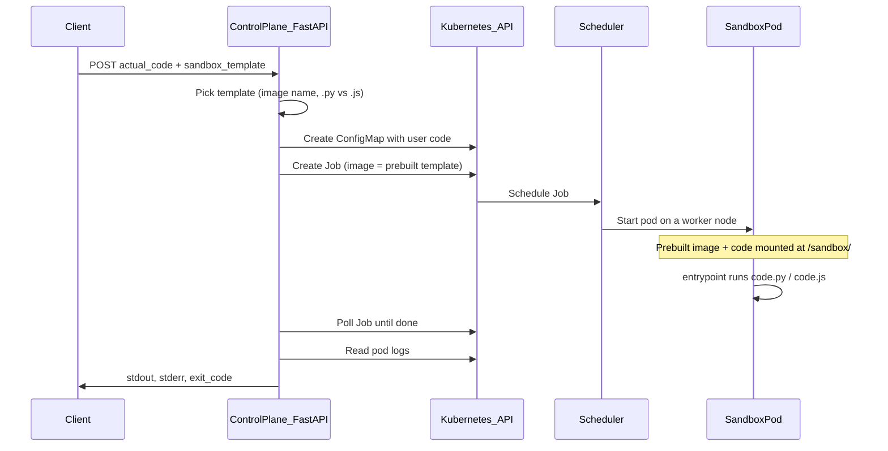
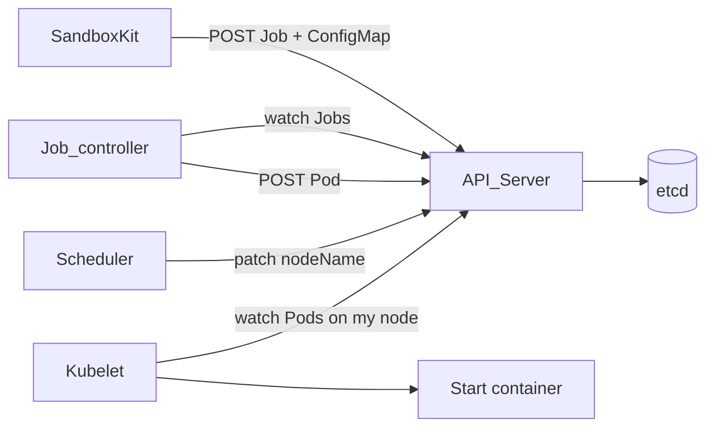

## Flow

1. SandboxKit creates JobPODTemplate + ConfigMap (with labels already in the Job’s pod template).
2. API server stores them in etcd.
3. Job controller watches Jobs; when it sees a new one, it creates a Pod from job.spec.template (your labels are already in that template).
4. Scheduler assigns the Pod to a node.
5. Kubelet on that node starts the container.




- each request has it's own /volume

## Flow:

1. First we provision resources: configMap and Create a Job

## 1.1 configmap yml provision:

```
apiVersion: v1
kind: ConfigMap
metadata:
  name: code-sandbox-88759734          # "code-" + sandbox_id
  namespace: sandboxes
  labels:
    app: sandboxkit
    sandbox-id: sandbox-88759734
data:
  code.py: |                            # key = code.{py|js} from template
    from fastapi import FastAPI
    import httpx

    app = FastAPI()
    print("fastapi", FastAPI.__name__)
    print("httpx", httpx.__version__)
```


| **Field**            | **Source in code**                         | **Meaning**                                            |
| -------------------- | ------------------------------------------ | ------------------------------------------------------ |
| `metadata.name`      | `f"code-{sandbox_id}"`                     | Unique ConfigMap name                                  |
| `metadata.namespace` | `settings.sandbox_namespace` (`sandboxes`) | Where it lives                                         |
| `metadata.labels`    | `app`, `sandbox-id`                        | For finding/deleting later                             |
| `data`               | `{ "code.py": actual_code }`               | Your snippet as one file (string keys → string values) |


## 1.2 **As YAML (simplified but faithful)**

```
apiVersion: batch/v1
kind: Job
metadata:
  name: sandbox-88759734               # same as sandbox_id
  namespace: sandboxes
  labels:
    app: sandboxkit
    sandbox-id: sandbox-88759734
spec:
  ttlSecondsAfterFinished: 300         # auto-delete Job after finish
  backoffLimit: 0                      # no retries
  template:                            # Pod spec the controller will create
    metadata:
      labels:
        app: sandboxkit
        sandbox-id: sandbox-88759734
    spec:
      restartPolicy: Never
      securityContext:
        runAsNonRoot: true
        runAsUser: 65534
        seccompProfile:
          type: RuntimeDefault
      containers:
        - name: sandbox
          image: deepjyot/sandboxkit-py-template:latest   # from template registry
          imagePullPolicy: IfNotPresent
          # command omitted → image ENTRYPOINT runs /sandbox/code.py
          resources:
            requests:
              cpu: 100m
              memory: 64Mi
            limits:
              cpu: 500m
              memory: 384Mi
          volumeMounts:
            - name: code-volume
              mountPath: /sandbox
              readOnly: true
            - name: tmp-volume
              mountPath: /tmp
          securityContext:
            allowPrivilegeEscalation: false
            readOnlyRootFilesystem: true
            capabilities:
              drop: ["ALL"]
      volumes:
        - name: code-volume
          configMap:
            name: code-sandbox-88759734    # links to ConfigMap above
            items:
              - key: code.py
                path: code.py               # file appears as /sandbox/code.py
        - name: tmp-volume
          emptyDir: {}
```

### **Field map**


| **Section**                | **What we set**                | **Why**                                      |
| -------------------------- | ------------------------------ | -------------------------------------------- |
| `metadata.name`            | `sandbox_id`                   | Job name = API `sandbox_id`                  |
| `spec.template`            | Pod template                   | Job controller creates **one pod** from this |
| `containers[].image`       | From `get_sandbox_templates()` | Prebuilt runtime (FastAPI or Node)           |
| `volumes[].configMap.name` | `configmap_name` from step 1   | Wires Job to your code                       |
| `volumeMounts`             | `/sandbox` + `/tmp`            | Code read-only; writable temp dir            |


### Why K8S?

- Customer already has K8s → fits on-prem deploy model
- Control plane needs: create/destroy workloads, CPU/mem limits, logs, TTL cleanup — K8s already does this
- Threat model: untrusted agent code, but **isolated per customer cluster** (not our shared multi-tenant cloud)

But,

- Same node = shared kernel; container escape is still a class of risk
- Great **phase 2** when we need stronger sandbox boundary *inside* a customer cluster or at massive scale

### improvements:

- BAD CODE: Pod A (sandbox)  --network-->  Service redis:6379  -->  Redis pod ..(we shou
  - **NetworkPolicy**: sandbox pods can only talk to DNS + maybe one egress endpoint
  - Redis should be authenticated
- Kernel escape: break container boundary itself, then filesystem/network both become easier

## ++Tradeoffs++

## bad k8s, good firecracker

-- Spins up a container (Linux namespace + cgroup isolation)

-- The container shares the **host kernel** — it's just process isolation

-- Boot time: ~1-3 seconds

-- Security boundary: if someone escapes the container, they're on the host kernel (dangerous syscall)

-- 

### How firecracker is Different:

-- Spins up a real **mini VM** — each sandbox gets its own kernel

-- Built by AWS, powers Lambda under the hood

-- Boot time: ~125ms (insanely fast for a VM)

-- Security boundary: kernel-level — escaping requires a hypervisor exploit

### Volume

(**One node → one kubelet.)**

```
POST { sandbox_template, actual_code }
       │
       ▼
┌──────────────────────────────────────────────────────────────┐
│  Control plane (API / etcd) — namespace: sandboxes           │
│                                                              │
│  ConfigMap  code-sandbox-abc123                              │
│             data.code.py = <your snippet>                    │
│                                                              │
│  Job        sandbox-abc123  ──creates──►  Pod (when scheduled)│
└──────────────────────────────────────────────────────────────┘
       │
       │  scheduler picks a worker (based on requests, capacity, …)
       ▼

════════════════════════════════════════════════════════════════
  WORKER NODE A                          WORKER NODE B
  (one kubelet)                          (one kubelet)
════════════════════════════════════════════════════════════════

  ┌─ kubelet (node agent) ─────────┐    ┌─ kubelet ─────────────┐
  │  manages ALL pods on this node │    │  manages ALL pods …   │
  └────────────────────────────────┘    └───────────────────────┘

  Pod sandbox-abc123-xxxxx                Pod sandbox-def456-yyyy
  (Job sandbox-abc123)                    (Job sandbox-def456)
       │                                       │
       │  volumes materialized under pod UID     │
       ▼                                       ▼
  /var/lib/kubelet/pods/<uid-A>/…          /var/lib/kubelet/pods/<uid-B>/…
    └─ …/configmap/code-volume/code.py      └─ …/configmap/code-volume/code.js
    └─ …/empty-dir/tmp-volume/                └─ …/empty-dir/tmp-volume/
       │ bind-mount                            │ bind-mount
       ▼                                       ▼
  ┌─ container "sandbox" ─────────┐    ┌─ container "sandbox" ─────────┐
  │  /sandbox/code.py  (read-only)│    │  /sandbox/code.js  (read-only)│
  │  /tmp              (emptyDir) │    │  /tmp              (emptyDir) │
  │  ENTRYPOINT → python …        │    │  ENTRYPOINT → node …          │
  └───────────────────────────────┘    └────────────────────────────────┘

  Pod other-app-… (unrelated)             (maybe empty, or more sandboxes)
       │
       └── same kubelet on Node A — not one kubelet per pod
```

## job

```
Job (name = sandbox-abc123)
└── spec.template  (PodTemplateSpec)
    └── spec  (PodSpec)
        ├── containers[0]
        │     ├── image: …/sandboxkit-py-template:latest
        │     ├── resources: { requests, limits }
        │     ├── env:                          ← Secret binding (if any)
        │     │     - name: SECRET_KEY1
        │     │       valueFrom.secretKeyRef:
        │     │         name: secrets-sandbox-abc123
        │     │         key: SECRET_KEY1
        │     └── volumeMounts:
        │           - name: code-volume  → mountPath: /sandbox
        │           - name: tmp-volume   → mountPath: /tmp
        └── volumes:                        ← Volume definitions
              - name: code-volume
                configMap:
                  name: code-sandbox-abc123    ← ConfigMap ref
                  items: [ code.py → code.py ]
              - name: tmp-volume
                emptyDir: {}                   ← not a ConfigMap/Secret
```

TODAY (kind, default runtime)

  Worker node

```
├── kubelet

├── pod A → container (host kernel)

└── pod B → container (host kernel)
```

WITH Firecracker via Kata (same K8s API)

  Worker node

```
├── kubelet

├── pod A → Firecracker microVM A (guest kernel)  ← on same worker

└── pod B → Firecracker microVM B
```

### SOme container terminologies:

## **The problem you’re solving**

- You run **untrusted user code** (agent snippets).
- You need **strong isolation** + **orchestration** (start/stop many sandboxes, limits, secrets, cleanup).
- **Nick’s ask:** isolation should be **MicroVM**-class (e.g. Firecracker), not only “normal container on shared kernel.”

### **Container (normal Linux container)**

- A **process** on the host, isolated with **namespaces + cgroups**.
- **Shares the host kernel** with every other container on that machine.
- Started by a **container runtime** (containerd + **runc**).
- What your **kind cluster uses today** for sandbox pods.

### **MicroVM**

- A **tiny real virtual machine**: own **guest kernel**, own memory, minimal devices.
- **Does not** share the app kernel with the host (stronger boundary).
- Started by a **VMM** (Virtual Machine Monitor).

### **Firecracker**

- A **VMM** (like a minimal QEMU) that **creates/manages microVMs** via KVM.
- Powers AWS Lambda-style isolation ([Firecracker](https://firecracker-microvm.github.io/)).
- **Not** Kubernetes. **Not** a container. It’s the engine that runs microVMs.

### **Docker (the word people overload)**

- `docker build` → builds **images** (layers with your Dockerfile). You already do this for template images.
- `docker run` → can start containers locally.
- **Kubernetes does not “use Docker” as its runtime anymore** on modern clusters. It talks to **containerd** (or CRI-O) via the **CRI** API.
- Normal Flow: Kubernetes → kubelet → containerd → runc → OCI container (shared host kernel)
- K8s **does not care** if underneath it’s runc or something else — as long as the runtime implements **CRI** and can start “pods.”

## **What are Kata / firecracker-containerd?**

They are **different runtimes under the same Kubernetes API** — not “special Kubernetes containers.”

### **Kata Containers**

- An **OCI/CRI-compatible runtime** that makes a Kubernetes **Pod** run inside a **microVM** (guest kernel inside).
- Can use **Firecracker** (or other VMMs) under the hood.
- To Kubernetes it still looks like: create Pod → image → start.
- **You still use Jobs, ConfigMaps, Secrets** — Sandboxkit code stays similar; **nodes** must install Kata + KVM.

### **firecracker-containerd**

- A **containerd plugin / integration** that talks to **Firecracker** to run workloads as microVMs.
- Another way to plug microVMs into the **containerd** ecosystem (used by some platforms; related to what Lambda/Fargate-style stacks use).
- Same idea: **containerd’s job** is to start workloads; this backend uses **Firecracker** instead of **runc**.
- **Today:** `kubelet → containerd → runc` → normal container (shared kernel).
- **Nick’s ask:** `kubelet → containerd → Kata` (or firecracker-containerd path) → **microVM** per pod.

**Yes on real Linux workers with KVM** (cloud VM, bare metal).

- **Kata Containers:** [kata-containers.io](http://kata-containers.io) — CRI/OCI runtime, often uses **Firecracker** or **QEMU** as VMM (configurable).
- **firecracker-containerd:** containerd integration that uses Firecracker directly — another stack; some platforms use Kata, some use this. For K8s, **Kata + RuntimeClass** is the common answer.

```
Target:
  Linux host with KVM (/dev/kvm)
    └── K8s worker (kubelet + containerd)
          └── Kata runtime  ← picks microVM instead of runc
                └── Firecracker (or QEMU)  ← this is the VMM / “hypervisor”
                      └── guest kernel + your template image inside
```

## What are we using?


|                            |                                       |                                                                      |
| -------------------------- | ------------------------------------- | -------------------------------------------------------------------- |
| **DigitalOcean droplet**   | One Ubuntu VM (2 vCPU, 4 GB)          | The “machine” everything runs on                                     |
| **KVM**                    | Linux kernel feature (`/dev/kvm`)     | Lets the host run real VMs efficiently (hardware virtualization)     |
| **k3s**                    | Small Kubernetes                      | Schedules pods, Jobs, Secrets, etc.                                  |
| **containerd**             | Container runtime (bundled with k3s)  | Starts workloads; can use different “runtimes” per pod               |
| **Kata (**`kata-qemu`**)** | Extra runtime plugged into containerd | For sandbox pods: **don’t use plain containers — spin up a microVM** |
| **QEMU**                   | VM emulator (`qemu-system-x86_64`)    | Builds and runs each microVM                                         |
| **KVM** (again)            | Used *by* QEMU (`accel=kvm`)          | Makes QEMU fast (not slow full emulation)                            |
| **sandboxkit**             | Your FastAPI app (one Deployment)     | API that creates sandbox **Jobs** with `runtimeClassName: kata-qemu` |


So: **Kubernetes → Kata → QEMU → KVM → microVM → your Python/JS code inside.**

### Flow:

1. You `POST /sandboxes` → **sandboxkit** pod (normal container on k3s).
2. sandboxkit creates a **Job** + **ConfigMap** (your code) [+ **Secret** if needed].
3. Job pod spec says `runtimeClassName: kata-qemu` (`USE_KATA=True` in code).
4. **Scheduler** puts the pod on the droplet.
5. **kubelet** asks **containerd** for runtime `kata-qemu`.
6. **Kata shim** starts **QEMU** with **KVM** → a small VM with its **own kernel** (6.18.x), not the host’s (6.8.x).
7. Inside that VM, your template image runs `code.py` / `code.js`.
8. Output comes back; Job finishes; pod goes **Succeeded**.

```
Your Mac  --push images-->  Docker Hub
                |
                v
         DO droplet (one Linux server)
                |
         +------+------+
         |      k3s    |  Kubernetes
         +------+------+
                |
    +-----------+-----------+
    |                       |
sandboxkit pod          sandbox Job pods
(normal container)    (each = microVM)
runc                         kata-qemu → QEMU+KVM
```


```
Kubernetes Pod (spec: image, env, runtimeClassName, …)
        ↓
kubelet (on the node — “run this pod”)
        ↓
containerd (CRI — actually starts workloads)
        ↓
runtime handler:  runc  OR  kata-qemu  OR  kata-fc  …
        ↓
either: normal container          OR: microVM (QEMU+KVM) + container inside it
```

## **What** `runtimeClassName: kata-qemu` **means**

Yes, in practice you are saying:

> *“For **this** pod, don’t use the default* `runc` *path. Use the* `kata-qemu` *runtime.”*


### (`kata-qemu` vs `kata-fc)`


|                          | **QEMU (what you use)**                  | **Firecracker**           |
| ------------------------ | ---------------------------------------- | ------------------------- |
| Own kernel?              | Yes                                      | Yes                       |
| KVM?                     | Yes                                      | Yes                       |
| Isolation quality        | Strong (VM boundary)                     | Strong (VM boundary)      |
| Typical boot time        | Slower                                   | Faster                    |
| Memory overhead          | Higher (~hundreds of MB class with Kata) | Lower                     |
| “Just works” on DO + k3s | **Usually yes** (why we picked it)       | **Maybe** — needs testing |
| Nick’s “microVM” ask     | ✅                                        | ✅                         |


```
Strong isolation (own kernel)
  ├── Kata + QEMU          ← you are here (kata-qemu)
  ├── Kata + Firecracker   ← kata-fc
  ├── Kata + CLH / Dragonball / …
  └── firecracker-containerd (no Kata)

Medium (shared kernel, extra layer)
  └── gVisor, hardened runc

Weaker / default
  └── runc only

Heavy / different shape
  ├── KubeVirt (full VM as Pod)
  └── One big VM per customer
```


|                         | **Kata + QEMU (what you did)**              | **firecracker-containerd (no Kata)**                          |
| ----------------------- | ------------------------------------------- | ------------------------------------------------------------- |
| **K8s fit**             | Built for K8s (`RuntimeClass`, kata-deploy) | Works via containerd runtime; **more DIY** on each distro/k3s |
| **VMM choice**          | QEMU, FC, CLH, … switch with RuntimeClass   | **Firecracker only**                                          |
| **Stack depth**         | K8s → Kata shim → QEMU/FC                   | K8s → containerd → Firecracker (one less project)             |
| **Generic Linux (DO)**  | QEMU path is **forgiving**                  | FC path **stricter** (devices, networking, image limits)      |
| **Ops / docs**          | Lots of K8s + Kata examples                 | More “platform team integrates containerd”                    |
| **Same security idea?** | Yes — microVM + guest kernel                | Yes — microVM + guest kernel                                  |


**Why not “no Kata” for you:** time, k3s, one-node demo — Kata gave a **known K8s install**; rolling custom `firecracker-containerd` on k3s was extra risk for little gain (you still get microVMs with `kata-fc` if you want Firecracker *under* Kata).


